# goudong-web-ui

## Project setup
```
npm install
```

### Compiles and hot-reloads for development
```
npm run serve
```

### Compiles and minifies for production
```
npm run build
```

### Lints and fixes files
```
npm run lint
```

### Customize configuration
See [Configuration Reference](https://cli.vuejs.org/config/).

## 流程
### 无感刷新token
无感刷新令牌有两种实现方式，一种是请求拦截器中判断令牌失效时间，当快要失效时，使用刷新令牌去重新获取新的认证和刷新令牌;另一种就是在相应拦截器中处理，当后端返回401时，执行刷新令牌请求，在执行过程中其余请求暂存到一个数组中。当刷新令牌的请求响应成功时，循环再执行所有未完成的请求。

本项目使用第二种方式进行实现，大致流程图如下：


我们针对上图主要对响应拦截器内的步骤进行概要说明：

1. 如果响应码等于401，就开始执行无感刷新令牌的流程。如果不等于，那就执行其它流程。
2. 如果请求url是登录请求或刷新令牌请求，那么直接响应用户认证失败/过期。如果都不是，那么就需要判断正在刷新令牌的标记（后面简记为"A"），A=true时，表示有请求正在执行刷新令牌接口，反之表示此时没有任何请求执行刷新令牌操作。
3. 当A=true时，将本次请求暂存到数组中，供后续补发。
4. 当A=false时，先将标记A改为true，使其后续请求都放入暂存数组中。然后开始请求刷新令牌请求。
5. 当刷新令牌请求的响应成功后，将本次请求进行补发，然后延时补发暂存数组中的请求。当响应失败时，标记A改为false，暂存数组清空，响应用户认证过期。

对于用户来说，上面的所有步骤都是透明的，用户在没有感知的请求况下进行刷新令牌，从而达到只要用户在刷新令牌有效期之间都不会退出登录。

### 无感实现加密解密

针对**axios**的`AxiosRequestConfig`进行扩展，添加有请求额外参数(`_requestOther`)，和响应额外参数(`_responseOther`)，**使其在axios的拦截器**中实现更多操作（aes加密，rsa加密，aes解密，弹出框等）。

总的流程如下，主要就是在请求拦截器中进行请求体加密，在响应拦截器中进行响应体解密（目前post请求，且请求体是json数据）：



##### 请求体加密

具体执行代码如下：

```ts
// 创建扩展AxiosRequestConfig的属性对象
let customAxiosRequestConfig = CustomAxiosRequestConfig
        .build()
		// 设置请求额外参数（这里设置aes加密）
        .req(RequestOther.builder().needAesEncrypt(true).build())
        // 设置响应额外参数（这里设置aes解密）
		.res(ResponseOther.builder().needAesDecrypt(true).build()
      );
// 携带config参数进行请求
UserAPI.demoSecrypt(data, customAxiosRequestConfig).then((response)=>{
    console.log("response", response.data)
})
```

> UserAPI就是定义用户模块所有接口配置文件



##### 响应体解密

