# goudong-web-ui

## Project setup
```
npm install
```

### Compiles and hot-reloads for development
```
npm run serve
```

### Compiles and minifies for production
```
npm run build
```

### Lints and fixes files
```
npm run lint
```

### Customize configuration
See [Configuration Reference](https://cli.vuejs.org/config/).

## 重要流程
### 无感刷新token
查看 README/axios响应拦截器实现无感刷新token.svg1


无感刷新令牌的大致步骤：
1. 判断响应码是否是401，如果响应码不等于401，就使用其它逻辑处理响应，如果响应码等于401就开始进行无感刷新token的流程了。
2. 判断请求url是否是登录请求或刷新令牌请求
   1. 如果是这两个请求其中之一的话，就需要返回一个错误（`return Promise.reject()`）
   2. 如果不是，那么需要继续执行无感流程
3. 判断是否已经开始刷新令牌了(isRefreshing = true)
   1. true：将本次请求放入一个数组中(requests)，并不返回resolve和reject，使其本次请求处于‘处理中’状态。
   2. false：即将开始刷新令牌
4. 发起刷新令牌的请求
5. 判断响应是否成功：
   1. true：
      1. 替换本地令牌信息
      2. 循环requests数组，进行补发请求。
      3. 将isRefreshing和requests恢复默认值
      4. 补发本次请求
   2. false：
      1. 清除本地令牌信息
      2. 将isRefreshing和requests恢复默认值
      3. 跳转到登录页面